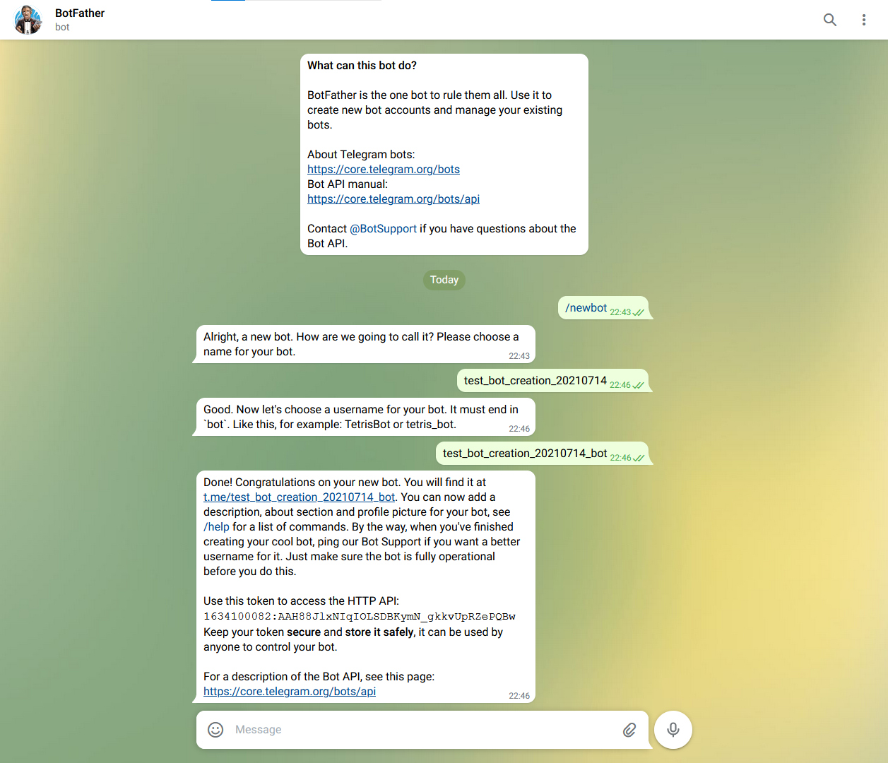

# Create a telegram bot
First you need a telegram account, then you need to use the [@BotFather](https://telegram.me/BotFather)

Then follow the messages like the image bellow:
  
After that you will have a token like on the image:
`1634100082:AAH88JlxNIqIOLSDBKymN_gkkvUpRZePQBw`
Copy and use on the .json config file

## Messages
 * The first message `/newbot`, starts the bot creation  
 * the next message you send its your bot "name"
 * the last is your bot username, it must end with `bot`